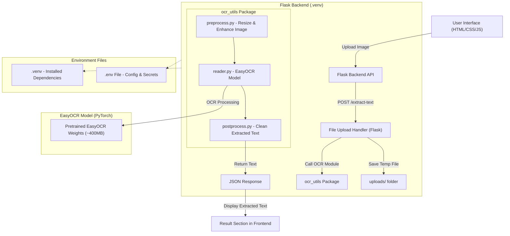

# TextWeave – Handwriting / Printed Note OCR

TextWeave is a web-based OCR tool and API that converts handwritten or printed notes from image files into text. It uses EasyOCR powered by PyTorch for accurate handwriting recognition. This project supports single-image upload, non-editable OCR results, and text download functionality.

<hr>

## Features

- Upload single image (handwriting or printed text).
- Display OCR results in non-editable textarea.
- Download recognized text as .txt.
- REST API backend using Flask.
- Modular Python code with preprocessing, OCR, and postprocessing.
- Environment variables support via .env.

## Project Structure

```
TextWeave/
├── backend/
│   ├── .venv/                 # Python virtual environment
│   ├── app.py                 # Flask main app
│   ├── ocr_utils/             # OCR helper package
│   │   ├── __init__.py
│   │   ├── reader.py          # EasyOCR wrapper
│   │   ├── preprocess.py      # Image preprocessing functions
│   │   └── postprocess.py     # Text postprocessing functions
│   ├── uploads/               # Temporary uploads folder
│   └── .env                   # Environment variables
├── frontend/
│   ├── index.html             # Frontend HTML
│   ├── style.css              # Styles (if separate)
│   └── script.js              # JS logic for uploading and calling backend
└── README.md

```


## Prerequisites

- Python 3.12+
- pip
- Virtual environment recommended (venv)
- GPU recommended for faster OCR, but CPU works

## Backend Setup

#### Create and activate virtual environment

```bash
cd backend
python3 -m venv .venv
source .venv/bin/activate   # Linux/Mac
.venv\Scripts\activate      # Windows
```

#### Install dependencies

```bash
pip install --upgrade pip   #Optional
pip install -r requirements.txt
```

#### Create .env file in backend/

```bash
PORT=8000
UPLOAD_FOLDER=uploads
ALLOWED_EXTENSIONS=jpg,jpeg,png
```

#### Ensure upload folder exists

```bash
mkdir -p uploads
```

### Running the Backend

```bash
source .venv/bin/activate  # activate venv
python app.py
```

#### The API will run at:

```bash
http://127.0.0.1:8000/
```

### API Endpoints

- GET / – Check if API is running

```json
{ "message": "AI Handwriting OCR API Running..." }
```

- POST /extract-text – Upload image to get OCR text

- Request:

```
POST /extract-text
Content-Type: multipart/form-data
file: <your_image_file>

```

- Response:

```json
{
  "extracted_text": "Recognized text from image..."
}
```

## Setting Up Frontend

- Open frontend/index.html in browser.
- Upload a single image (handwriting or printed).
- OCR text will appear in a non-editable textarea.
- Click Download TXT to save extracted text.
- Make sure frontend is allowed to communicate with backend (CORS enabled in Flask).

## Notes

- Single image only for MVP.
- Backend deletes uploaded files after processing.
- PyTorch + EasyOCR model download is ~400–900MB depending on system.
- GPU is recommended but not required.

## Author
fl4nk3r


Date: 26th October 2025

## License

MIT License – Free to use, modify, and distribute.
